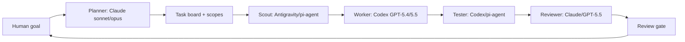

# Multi-Agent Team Architecture

## Objective

AgentTeam should coordinate multiple coding tools as a small accountable team:

- Claude Code: opus4.7, opus4.8, sonnet4.6
- Codex: GPT-5.4, GPT-5.5
- Antigravity: Gemini 3.5 Flash
- pi-agent: DeepSeek v4 Flash, Kimi 2.6

The goal is not to run every model on every task. The goal is to route work to the cheapest capable agent, reserve premium models for high-leverage decisions, and make every handoff visible through tasks, evidence, and review gates.

## Core Principle

Use a tiered team, not a swarm.

Every run should have:

- one Planner
- one or more Workers
- one Reviewer
- one Tester or Verifier
- one Human approval gate

Agents can be backed by different tools/models, but AgentTeam should expose them as roles with budgets, capabilities, write scope, and review responsibility.

Operational updates, run artifacts, progress rules, and handoff requirements are defined in [agent-development-standard.md](agent-development-standard.md).

## Recommended Role Routing

| Role | Default Tool | Premium Escalation | Best For |
|---|---|---|---|
| Planner | Claude sonnet4.6 | Claude opus4.8 | ambiguous product planning, task decomposition, edge cases |
| Coder | Codex GPT-5.4 | Codex GPT-5.5 | codebase edits, tests, integration, refactors |
| Reviewer | Claude opus4.7 or GPT-5.5 | Claude opus4.8 + GPT-5.5 double review | architecture review, correctness, regressions |
| Tester | Codex GPT-5.4 or pi-agent | GPT-5.5 | local validation, build/test loops, browser QA |
| Scout | Antigravity Gemini 3.5 Flash or pi-agent | none by default | cheap exploration, file search, summarizing logs |
| Scribe | pi-agent Kimi 2.6 | Claude sonnet4.6 | docs, release notes, context summaries |

## Model Strength Use

### Claude

Use Claude when the work is language-heavy or judgment-heavy:

- turning a vague goal into tasks
- identifying ambiguous requirements
- writing product briefs
- reviewing architecture choices
- producing concise handoff summaries
- challenging whether the plan matches the product thesis

Use opus only when the decision is expensive to get wrong. Use sonnet for routine planning and summaries.

### Codex

Use Codex when the work is repository-grounded:

- implementing features
- modifying many files safely
- running tests and fixing failures
- resolving merge conflicts
- integrating branches
- building runnable prototypes

Use GPT-5.5 for complex integration and review. Use GPT-5.4 for normal implementation loops.

### Antigravity

Use Antigravity as a fast scout:

- inspect unfamiliar areas
- summarize a directory or dependency
- find candidate files
- compare two approaches quickly
- generate cheap first-pass notes

Do not give it broad write ownership until AgentTeam can enforce file scopes and review gates.

Initial integration mode:

- Treat Antigravity as a configurable external adapter.
- If a CLI command is available, AgentTeam stores the command template in adapter config.
- If only an app/API is available, AgentTeam creates the task packet and records manual import/export until automation is possible.
- Default permission: read-only scout.
- Default output: compact scout report with relevant files, risks, and suggested next agent.

Antigravity should usually run before Claude opus or Codex GPT-5.5. Its job is to reduce the premium model's context, not to make the final decision.

### pi-agent

Use pi-agent for low-cost background work:

- log compression
- context restore summaries
- documentation drafts
- simple test triage
- duplicate issue detection
- recurring maintenance checks

Keep it mostly read-only or narrow-scope write until confidence is proven.

Initial integration mode:

```bash
pi -p \
  --model kimi-2.6 \
  --tools read,grep,find,ls \
  --session-dir .agentteam/sessions/pi \
  "<task packet>"
```

Use `--tools read,grep,find,ls` for scouts and scribes. Enable `bash` only for tester tasks. Enable `edit/write` only after AgentTeam creates a scoped worktree and the human approves the write scope.

Recommended pi-agent roles:

- Kimi 2.6: scribe, context compression, docs draft, release notes.
- DeepSeek v4 Flash: cheap code search, test-log triage, simple implementation spike.

pi-agent should return short artifacts that can be passed to stronger agents:

- scout report
- log summary
- doc draft
- failing test summary
- list of candidate files

## Token-Saving Strategy

### 1. Route by Uncertainty and Blast Radius

Use cheap agents for low-uncertainty, low-risk work.

Escalate only when:

- requirements are ambiguous
- architecture is changing
- many files are touched
- tests fail in a confusing way
- the diff is security-sensitive
- human approval is needed

### 2. Pass Artifacts, Not Chat Logs

Every agent handoff should be a compact artifact:

- task id
- goal
- write scope
- current files
- constraints
- commands already run
- known failures
- expected output

Do not pass full conversation history unless the agent truly needs it.

### 3. Use Scouts Before Premium Models

Before asking opus or GPT-5.5 to solve a large problem, ask a cheap scout to produce:

- relevant files
- current behavior
- failed commands
- likely risk areas

Then pass that compact scout report to the premium agent.

### 4. Cache Project Memory

Use `memory/learnings.jsonl` for durable rules:

- local architecture decisions
- known traps
- preferred patterns
- model routing outcomes
- failed approaches

Before starting a task, AgentTeam should run memory retrieval and inject only the relevant high-confidence learnings.

### 5. Make Review Selective

Not every diff needs premium review.

Suggested review routing:

- docs-only: pi-agent or Claude sonnet
- simple UI: Codex self-check + screenshot
- shared logic: GPT-5.5 review
- architecture/security/auth: Claude opus + GPT-5.5 review

## Execution Flow



## AgentTeam Runtime Requirements

### Agent Adapter

Each tool needs an adapter with a common interface:

```ts
interface AgentAdapter {
  id: string;
  label: string;
  provider: "claude" | "codex" | "antigravity" | "pi-agent";
  model: string;
  capabilities: AgentCapability[];
  run(task: AgentTask): Promise<AgentRunResult>;
}
```

### Task Contract

```ts
interface AgentTask {
  id: string;
  role: "planner" | "coder" | "reviewer" | "tester" | "scout" | "scribe";
  goal: string;
  context: string;
  writeScope: string[];
  readScope: string[];
  budget: {
    maxTokens?: number;
    maxCostUsd?: number;
    maxMinutes?: number;
  };
  requiredOutputs: string[];
  approvalPolicy: "read_only" | "scoped_writes" | "approval_required";
}
```

### Evidence Capture

Every adapter should return:

- messages
- commands
- file changes
- test results
- final summary
- blockers
- cost/time estimate when available

AgentTeam stores these as activity events and shows them in the Run Console.

### Delegation Tracking

AgentTeam should persist every delegated run as a first-class record:

```ts
interface DelegatedRun {
  id: string;
  taskId: string;
  agentId: string;
  provider: "claude" | "codex" | "antigravity" | "pi-agent";
  model: string;
  role: "planner" | "coder" | "reviewer" | "tester" | "scout" | "scribe";
  branch: string;
  worktree: string;
  status: "queued" | "running" | "blocked" | "completed" | "merged" | "failed";
  progress: number;
  assignedAt: string;
  lastHeartbeat: string;
  currentStep: string;
  nextStep: string;
  evidence: string[];
}
```

The UI should show delegated runs separately from the task board. A task card answers "what work exists"; a delegated run answers "who is doing it, with which model, where, under what budget, and how far along."

Progress sources:

- CLI process state: queued/running/exited.
- Heartbeat file: `.agentteam/runs/<run-id>/heartbeat.json`.
- Git state: branch exists, changed files, commit exists, merged.
- Artifact state: summary/report/test output exists.
- Human state: blocked on approval or inbox question.

Minimum run directory:

```text
.agentteam/runs/<run-id>/
├── task.json
├── heartbeat.json
├── transcript.jsonl
├── summary.md
├── artifacts/
└── result.json
```

This is how the human sees delegated work:

- Delegation tracker: all active and recent runs.
- Task board: task status and owner.
- Run console: event stream from all tools.
- Agent inbox: blockers and approvals.
- Review gate: final diff, test evidence, and verdict.

### Adapter Command Templates

Claude planner/reviewer:

```bash
claude-official -p \
  --permission-mode bypassPermissions \
  --allowedTools Read,Write,Edit,MultiEdit,Bash \
  "<task packet>"
```

Codex worker/tester:

```bash
codex exec \
  -C "<worktree>" \
  -s danger-full-access \
  --dangerously-bypass-approvals-and-sandbox \
  "<task packet>"
```

pi-agent scout/scribe:

```bash
pi -p \
  --model "<model>" \
  --tools read,grep,find,ls \
  --session-dir ".agentteam/sessions/pi" \
  "<task packet>"
```

Antigravity scout:

```bash
# Configurable until a stable CLI/API is available.
<antigravity-command> "<task packet>"
```

## Worktree Policy

Use isolated worktrees for parallel agents.

Recommended defaults:

- one branch per agent task
- explicit file write scope
- no destructive commands
- merge through main review gate
- run build/tests after each merge

Branch naming:

- `agent/claude-plan-<task>`
- `agent/codex-impl-<task>`
- `agent/pi-docs-<task>`
- `agent/antigravity-scout-<task>`

## Budget Policy

Default routing should optimize for cost:

1. pi-agent or Antigravity scouts first
2. Claude sonnet or Codex GPT-5.4 for normal task execution
3. Claude opus or Codex GPT-5.5 only for complex planning, integration, or review
4. double-review only for high-risk changes

Budget controls per task:

- max model tier
- max runtime
- max retries
- max file count
- requires human approval before premium escalation

## Practical MVP Path

### Phase A: Manual Orchestration

Implement UI around human-triggered runs:

- user chooses an agent
- AgentTeam creates task prompt
- agent runs in worktree
- AgentTeam imports summary and diff
- human merges or rejects

### Phase B: Semi-Automatic Routing

Add routing rules:

- docs -> pi-agent or Claude sonnet
- implementation -> Codex GPT-5.4
- complex code review -> GPT-5.5
- product ambiguity -> Claude opus
- exploration -> Antigravity

### Phase C: Budgeted Auto-Team

Let AgentTeam select agents automatically within budget:

- cheap scout first
- worker second
- reviewer third
- escalate only on uncertainty or failure

## First Integration Target

Start with Codex and Claude because they cover the highest-value loop:

1. Claude Planner produces scoped tasks.
2. Codex Coder implements in a worktree.
3. Codex Tester runs build/tests/browser checks.
4. Claude Reviewer reviews the diff.
5. Human approves merge.

After that loop is stable, add Antigravity and pi-agent as cheap scouts/scribes to reduce premium-model context load.
